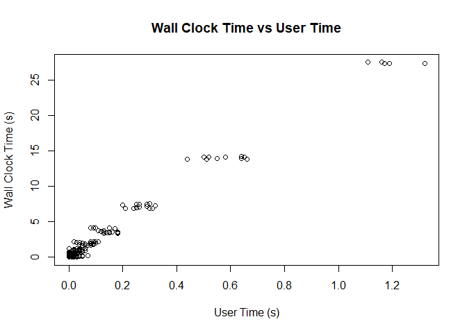
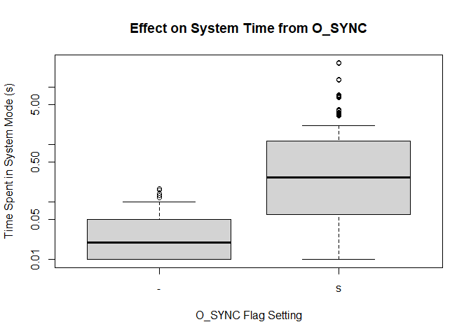
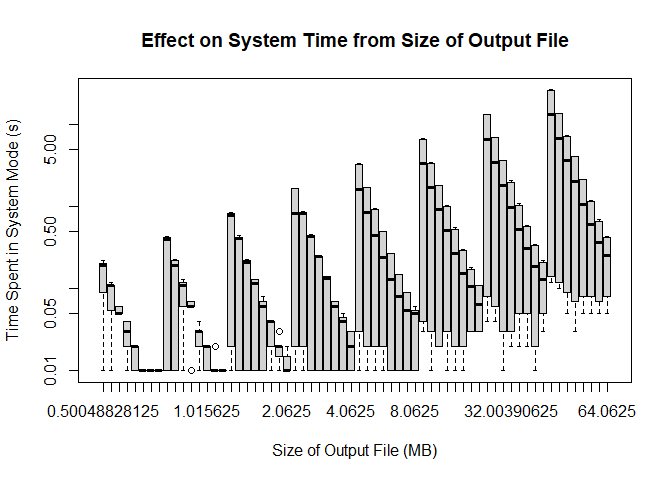
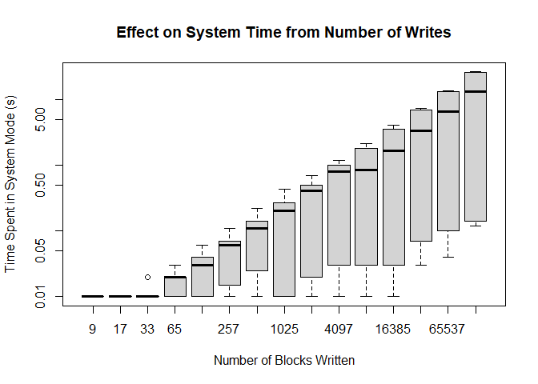
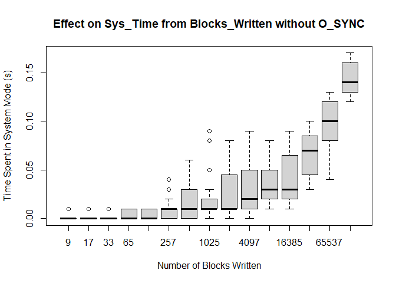
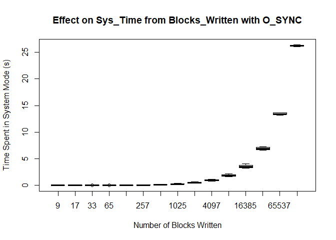

# O_SYNC and Blocksize Effects on IO Performance


## Overview

This document analyses the performance data produced on a Compaq desktop from the code in [do_perf_io_test.c](https://github.com/dfhawthorne/demos/blob/master/filesystem_performance/do_perf_io_test.c).

## Experimental Design

The experimental design consists of two (2) independent variables with a treatment being the use of the *O_SYNC* flag. Three (3) reponse variables are collected. Each experiment is run five (5) times.

The two (3) independent variables are:

1. The size of the I/O buffer used (*Block_Size*);
2. The size of the output file (*Num_Bytes_Read*).

The single treatment is:

1. Whether the output file is opened with O_SYNC or not (*Sync*);

The three (3) response variables are:

1. Wall clock time (*Wall_Clock_Time*)
2. Time spent in user mode (*User_Time*)
3. Time spent in system mode (*Sys_Time*)

All of these times are measured in seconds to a precision of a millisecond.

There is a relationship between these response variables:
$\text{Wall_Clock_Time} \ge \text{User_Time} + \text{Sys_Time}$


## Explanation of O_SYNC

The manual page for [open (2)](http://man7.org/linux/man-pages/man2/open.2.html) says of the O_SYNC flag:

> Write operations on the file will complete according to the requirements of synchronized I/O file integrity completion (by contrast with the synchronized I/O data integrity completion provided by O_DSYNC.)
>
> By the time write(2) (or similar) returns, the output data and associated file metadata have been transferred to the underlying hardware (i.e., as though each write(2) was followed by a call to fsync(2)).

## Terminology

* **Block Size** refers to the amount of data written to disk in a single write call. Depending at which layer this write call happens, the size can vary. These layers include the user program, the file-system driver, and the disk hardware driver. In this analysis, the block size refers to the amount of data passed to the Linux kernel write procedure.
* **Buffer Size** refers to the size of memory set aside for I/O calls (such as write). In the test program, the buffer is sized to be one (1) block.
* **User Mode** refers to the program running with normal privileges.
* **System Mode** refers to the program running with elevated priviliges to access key system resources such as a disk drive. The use of the *write* system call causes a transition from user mode to system mode while the data is transferred to internal buffers or to the disk drive, and then back to user mode.

## Generate the Test Results

The following code is used to generate the results used in this analysis:

```bash
./do_perf_io_test -n 5 dummy.dat >compaq_20200424.csv
```

**Note:** This command took over thirty (30) hours to run on my test machine!

This will the test five (5) times each for each of the following block sizes:  

* 512, 1024, 2048, 4096, 8192, 16384, 32768, 65536  

and for various file sizes.

## Summary of Test Results

The summary of the results is:

```r
summary(raw_data)
```

```
##    Block_Size    Sync    Num_Bytes_Read     Wall_Clock_Time     User_Time      
##  Min.   :  512   -:320   Min.   :  524800   Min.   : 0.0010   Min.   :0.00000  
##  1st Qu.: 1792   s:320   1st Qu.: 1851776   1st Qu.: 0.0090   1st Qu.:0.00000  
##  Median : 6144           Median : 6324480   Median : 0.0505   Median :0.00000  
##  Mean   :16320           Mean   :16728000   Mean   : 0.9139   Mean   :0.03744  
##  3rd Qu.:20480           3rd Qu.:21020800   3rd Qu.: 0.2607   3rd Qu.:0.02000  
##  Max.   :65536           Max.   :67174400   Max.   :27.4730   Max.   :1.32000  
##     Sys_Time      
##  Min.   : 0.0000  
##  1st Qu.: 0.0100  
##  Median : 0.0450  
##  Mean   : 0.8764  
##  3rd Qu.: 0.2500  
##  Max.   :26.3600
```

## Relationship Between Measured Times

The times measured includes the following activities:

* Opening output file
* Allocating and zeroing out a buffer
* Writing out buffer the required number of times
* Flushing and closing output file

There is a fourth implied time measurement - that of unaccounted for time $= \text{Wall_Clock_Time} - \text{User_Time} - \text{Sys_Time}$.

### Wall Clock Time versus User Time

The relationship between the wall clock time and the time spent in user mode is somewhat complicated, but shows a general linear relationship:

```r
plot(
  Wall_Clock_Time ~ User_Time,
  data=raw_data,
  main='Wall Clock Time vs User Time',
  xlab='User Time (s)',
  ylab='Wall Clock Time (s)'
  )
```

<!-- -->

There are distinct clusters for meaurements of Wall clock time, while the time spent in user mode spread over the full range with a heavy concentration at the lower bound.

The range of values for both response variables cover different ranges (*Wall_Clock_Time* goes up to 32 seconds while *User_Time* only goes up to 1.3 seconds).

### Wall Clock Time versus System Time

The relationship between the wall clock time and the time spent in system mode is somewhat complicated, but shows a general linear relationship:

```r
plot(
  Wall_Clock_Time ~ Sys_Time,
  data=raw_data,
  main='Wall Clock Time vs System Time',
  xlab='System Time (s)',
  ylab='Wall Clock Time (s)'
  )
```

<!-- -->

There is almost a perfect relationship between the wall clock time and the time spent in system mode. This should not be unsurprising as the code mainly does a single system call, *write*, repeatedly.

The values for both response variables also cover the same range.

This linear relationship means that any unaccounted for time can be ignored for this analysis.

### Reduced Set of Response Variables

We should only consider the response variable, *Sys_Time*, from now on as *Wall_Clock_Time* is highly correlated to the former, and *User_Time* appears to be neglible in comparison. This also means that any unaccounted for time can be ignored.

## Recalibrate Some Treatment Variables

I will recalibrate the block size treatment to be measured in KB, and the size of the output file to be measured in MB:

```r
raw_data['Block_Size_K'] <- raw_data['Block_Size'] / 1024
raw_data['File_Size_M'] <- raw_data['Num_Bytes_Read'] / 1024 / 1024
```

This recalibration makes visual analysis much earier.

## Effect of Block Size on System Time

I will use a box-plot to get an overview of the effect of the size of the I/O buffer (also known as the block size) on the amount of time spent in system mode.


```r
boxplot(
  Sys_Time ~ Block_Size_K,
  data=raw_data,
  xlab='Size of I/O Buffer (Kb)',
  ylab='Time Spent in System Mode (s)',
  main='Effect on System Time from Block Size'
  )
```

<!-- -->

The plot is deceptive because the categories on the X-axis are on a logarithmic scale. The preponderance of very low values obscures many details.

Now if we plot the y-axis (*Sys_Time*) on a logarithmic scale, the effects on increasing the size of the I/O buffer can be more readily seen:

```r
boxplot(
  Sys_Time ~ Block_Size_K,
  data=raw_data[raw_data$Sys_Time > 0.0, ],
  xlab='Size of I/O Buffer (Kb)',
  ylab='Time Spent in System Mode (s)',
  main='Effect on System Time from Block Size',
  log='y'
  )
```

<!-- -->

**Note** Data skew has been introduced for buffer sizes greater than 8 KB because all zero measurements have been excluded. Thus, the plots for 16 KB and up are skewed upwards.

Generally, the use of a larger buffer size results in a reduction in system time (both for maximum and average values).

## Effect on System Time from O_SYNC

The treatment for opening the output file with *O_SYNC* is encoded in the *Sync* treatment variable as follows:

* **s** if the O_SYNC flag is set
* **-** otherwise

Now if we plot the y-axis (*Sys_Time*) on a logarithmic scale, the effects on increasing the setting of the *O_SYNC* flag can be more readily seen:

```r
boxplot(
  Sys_Time ~ Sync,
  data=raw_data[raw_data$Sys_Time > 0.0, ],
  xlab='O_SYNC Flag Setting',
  ylab='Time Spent in System Mode (s)',
  main='Effect on System Time from O_SYNC',
  log='y'
  )
```

<!-- -->

**Note** Data skew has been introduced for the *O_SYNC* flag being unset because all zero measurements have been excluded. Thus, the plot for the *O_SYNC* flag being unset are skewed upwards.

Generally, the use of the *O_SYNC* flag results in a significant increase in system time (both for maximum and average values).

## Effect of Output File Size on System Time

The last treatment variable is the final size of the output file. These treatment levels have been recalibrated to be in MB to make plots easier to read. Again, I will be using a logarithmic Y-Axis.


```r
boxplot(
  Sys_Time ~ File_Size_M,
  data=raw_data[raw_data$Sys_Time > 0.0, ],
  xlab='Size of Output File (MB)',
  ylab='Time Spent in System Mode (s)',
  main='Effect on System Time from Size of Output File',
  log='y'
  )
```

<!-- -->

**Note** There is skew introduced into the data plotted. All zero measurements have been removed, and thus, the plots are shifted upwards.

This is a complicated graph. It is obvious that the size of the output file is not a simple treatment. Something else is confounded with it. A possible candidate is the number of blocks written.

Here I introduce a new treatment variable called *Blocks_Written* which is calculated from the ratio of the size of the output file (*Num_Bytes_Read*) to the size of the I/O buffer (*Block_SIze*). Then I plot the interaction between *Blocks_Written* and the time spent in system mode (*Sys_Time*) on a logarithmic Y-axis:


```r
raw_data['Blocks_Written'] <- raw_data['Num_Bytes_Read'] / raw_data['Block_Size']
boxplot(
  Sys_Time ~ Blocks_Written,
  data=raw_data[raw_data$Sys_Time > 0.0, ],
  xlab='Number of Blocks Written',
  ylab='Time Spent in System Mode (s)',
  main='Effect on System Time from Number of Writes',
  log='y'
  )
```

<!-- -->

**Note:** The data plotted is skewed upwards because all zero measurements were removed from the source data.

**Note:** Because of the values chosen for the X-axis, there is, in effect, a logarithmic scale on the X-axis as well. This might indicate that there is a power law relationship between *Sys_Time* and *Blocks_Written*. That is, $\text{Sys_Time} = A * \text{Blocks_Written} ^ B$. But the width of the box plots could hide other factors.

## Problems with Test Program

**Note:** There appears to be an *off-by-one* error with the program to generate the test results. The number of blocks written was expected to be a power of two (2).

**Note:** Future versions of the program will have to present timings with greater granularity than milliseconds.

## What to do with Measurements of Zero (0)?

As noted above in the various logarithmic plots, there are a significant number of measurements of the *Sys_Time* treatment that are zero (0). This means that the actual values are less than 0.5 milliseconds.

I will keep them at this stage and rely on models that use linear combinations of the treatment variables. Thus, any investigation of a power law relationship between *Sys_Time* and *Blocks_Written* will be ignored for the time being.

## Effect of O_SYNC on the Relationship between Sys_Time and Blocks_Written

I want to get a feel about how the presence and absence of the O_SYNC flag on the behaviour of *Sys_Time* with different levels of *Blocks_Written*.

### Effect on Sys_Time from Blocks_Written without O_SYNC

First, I will want to see what the effect on *Sys_Time* from different levels of *Blocks_Written*  without the treatment of the *O_SYNC* flag being set:

```r
boxplot(
  Sys_Time ~ Blocks_Written,
  data=raw_data[raw_data$Sync == '-', ],
  main='Effect on Sys_Time from Blocks_Written without O_SYNC',
  xlab='Number of Blocks Written',
  ylab='Time Spent in System Mode (s)'
  )
```

<!-- -->

**Note:** This plot only appears to be exponential because the values on the X-axis are increasing powers of two (2) plus 1. That is, the X-axis is, in effect, logarithmic.

Although there a general relationship between the number of blocks written (*Blocks_Written*) and the time spent in system mode (*Sys_Time*), there is a lot of noise involved. This noise may be caused by the other independent variable (*Block_Size*).

### Effect on Sys_Time from Blocks_Written with O_SYNC

Second, I will want to see what the effect on *Sys_Time* from different levels of *Blocks_Written* with the treatment of the *O_SYNC* flag being set:

```r
boxplot(
  Sys_Time ~ Blocks_Written,
  data=raw_data[raw_data$Sync == 's', ],
  main='Effect on Sys_Time from Blocks_Written with O_SYNC',
  xlab='Number of Blocks Written',
  ylab='Time Spent in System Mode (s)'
  )
```

<!-- -->

**Note:** This plot only appears to be exponential because the values on the X-axis are increasing powers of two (2) plus 1. That is, the X-axis is, in effect, logarithmic.

There a very strong relationship between the number of blocks written (*Blocks_Written*) and the time spent in system mode (*Sys_Time*). Based on the results, I can confidently predict the value of *Sys_Time* based on a given value of *Blocks_Written*. There is very little noise involved.

For the treatment of *O_SYNC*, the effect of the other independent variable (*Block_Size*) can be ignored.

THus, there is a very strong interaction between the treatment (*Sync*) and the two (2) independent variables (*Blocks_Written* and *Block_Size*).

## First Linear Model

Because of the obvious strong interactions noted above, I propose that my first linear model calculate *Sys_Time* on the following factors:

* *Block_Size* (verified visually above)
* *Blocks_Written* (verified visually above)
* *Sync* (verified visually above)
* *Blocks_Written* and *Sync* (verified visually above)

This may result in an overfitted model, but is simple to specify.


```r
first_model <- glm(
  Sys_Time ~ Block_Size + Blocks_Written * Sync,
  data=raw_data
)
summary(first_model)
```

```
## 
## Call:
## glm(formula = Sys_Time ~ Block_Size + Blocks_Written * Sync, 
##     data = raw_data)
## 
## Deviance Residuals: 
##      Min        1Q    Median        3Q       Max  
## -0.56207  -0.05717  -0.01218   0.00946   0.65153  
## 
## Coefficients:
##                        Estimate Std. Error t value Pr(>|t|)    
## (Intercept)           2.021e-02  7.698e-03   2.625 0.008879 ** 
## Block_Size           -2.265e-07  2.124e-07  -1.066 0.286673    
## Blocks_Written        1.079e-06  3.083e-07   3.500 0.000498 ***
## Syncs                 6.859e-02  9.342e-03   7.342 6.48e-13 ***
## Blocks_Written:Syncs  2.010e-04  4.276e-07 469.948  < 2e-16 ***
## ---
## Signif. codes:  0 '***' 0.001 '**' 0.01 '*' 0.05 '.' 0.1 ' ' 1
## 
## (Dispersion parameter for gaussian family taken to be 0.01203032)
## 
##     Null deviance: 5845.9147  on 639  degrees of freedom
## Residual deviance:    7.6393  on 635  degrees of freedom
## AIC: -1005.8
## 
## Number of Fisher Scoring iterations: 2
```

The non-zero intercept is unexpected as the number of *write* calls greatly outnumber the other system calls in the measurement period. This model predicts an overhead of about 20 milliseconds with a 95% bounds of 18 and 22 milliseconds.

What was unexpected is the lack of an effect from *Block_Size* alone. However on reflection, I had combined two independent variables (*Block_Size* and *Num_Bytes_Read*) into a single variable (*Blocks_Written*).

## Second Linear Model

I now revise the first linear model to exclude the *Block_Size* variable:

```r
second_model <- glm(
  Sys_Time ~ Blocks_Written * Sync,
  data=raw_data
)
summary(second_model)
```

```
## 
## Call:
## glm(formula = Sys_Time ~ Blocks_Written * Sync, data = raw_data)
## 
## Deviance Residuals: 
##      Min        1Q    Median        3Q       Max  
## -0.56634  -0.05826  -0.01219   0.01138   0.65377  
## 
## Coefficients:
##                       Estimate Std. Error t value Pr(>|t|)    
## (Intercept)          1.599e-02  6.607e-03   2.420 0.015780 *  
## Blocks_Written       1.143e-06  3.024e-07   3.779 0.000172 ***
## Syncs                6.859e-02  9.343e-03   7.341  6.5e-13 ***
## Blocks_Written:Syncs 2.010e-04  4.277e-07 469.898  < 2e-16 ***
## ---
## Signif. codes:  0 '***' 0.001 '**' 0.01 '*' 0.05 '.' 0.1 ' ' 1
## 
## (Dispersion parameter for gaussian family taken to be 0.01203291)
## 
##     Null deviance: 5845.9147  on 639  degrees of freedom
## Residual deviance:    7.6529  on 636  degrees of freedom
## AIC: -1006.6
## 
## Number of Fisher Scoring iterations: 2
```
