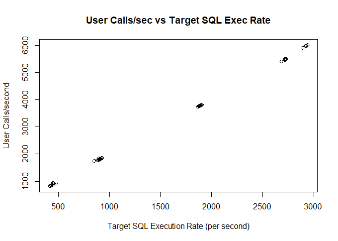

## Summary

I recreated the System Under Test (SUT) database server using the Xen
hypervisor. I repeated the experiment with this new VM. This time,
there was no significant difference between the use of the DEFAULT and
the INTERNAL plans for Oracle Resource Manager (ORM).

The significant difference between ORM plans noted for SUT running on a
VM with six (6) physicals on `COOGEE` appears to be an exception. This
result was not reproduced in any other experimental configuration.

## Overview

Following on my earlier analysis in
[Preliminary Analysis of the Effect of ORM Plans on Throughput](https://github.com/dfhawthorne/demos/wiki/Preliminary-Analysis-of-the-Effect-of-ORM-Plans-on-Throughput),
I recreated the Oracle 19C database as a VM running on a Xen server. I
did three (3) runs there:

1. One (1) virtual CPU in a pool of two (2) physical CPUs
2. Six (6) virtual CPUs in a pool of two (2) physical CPUs
3. Six (6) virtual CPUs in a pool of six (6) physical CPUs

The second run was a happy accident.

The experimental set-up is the same as described
[here](https://github.com/dfhawthorne/demos/wiki/Preliminary-Analysis-of-the-Effect-of-ORM-Plans-on-Throughput#experimental-setup).

The distribution of the residuals in the following models is not
normally distributed. This invalidates the use of the linear modelling
techniques I have been using:

| Model | Shapiro-Wilkes p-value |
| ----- | --------------------- |
| `rate ~ cores * server * plan` | 0.0008391 |
| `rate ~ num_cpus * server * plan * pool_size` | 0.0239 |
| `rate ~ cores * server` | 0.001096 |

The addition of the factor (`pool_size` - number of physical CPUs in
the VM server pool) does not make any sense in the operation of the VM
hypervisor when number of CPUs is set to one (1).

## Host Characteristics

The characteristics of each host are:

| Metric                   | `COOGEE`   | `VICTORIA`  |
| ------------------------ | ---------- | ----------- |
| Number of Physical cores | 6          |           8 |
| CPU GHz                  |       2.80 |        3.30 |
| CPU Model                | i5-8400    | Xeon E31245 |
| VM Manager Name          | VirtualBox | Xen         |
| VM Manager Version       | 6.1.10     | 3.4.4       |
| OS Name                  | Ubuntu     | Xen         |
| OS Version               | 20.04.01   | 3.4.4       |

## Metrics Collected

The original set of metrics collected was:

1. Number of CPUs reported in AWR Report
2. Elapsed time covered by AWR Report
3. Number of executions of target SQL statement:

### Target SQL

The CPU intensive SQL statement is a simple table scan of the `ITEMS`
table in the `TPCC` schema:
```sql
SELECT count(*) FROM tpcc.items;
```

### Extra Metrics Collected

This analysis uses an extended group of metrics from both VM servers:

1. Amount of memory reported by the machine in GB
2. Name of host platform
3. The following rates (per second) from the _Load Profile_ in the AWR Report:
  1. _Logical reads (blocks)_
  2. _User calls_
  3. _Executes (SQL)_
4. Database ID reported in AWR Report
5. Database instance startup time
6. Time when AWR Snap was first taken

## Summary of Data

The metrics from the AWR reports from __COOGEE__ and __VICTORIA__ are
combined. The following categories are identified:

- `plan` (an abbreviation is encoded in `plan_abbr`)
- `platform`
- `startup_time` (an abbreviation is encoded in `expr_cfg`)
- `dbid`


```r
all_data              <- rbind(virtualbox_data, xen_data)
all_data$platform     <- factor(all_data$platform)
all_data$dbid         <- factor(all_data$dbid)
all_data$plan         <- factor(all_data$plan)
all_data$startup_time <- factor(all_data$startup_time)
all_data$X            <- NULL
all_data["plan_abbr"] <- factor(
  all_data$plan,
  c("INTERNAL_PLAN", "DEFAULT_PLAN"),
  labels=c("N", "D")
)
all_data["expr_cfg"]  <- factor(
  all_data$startup_time,
  c("12-Jan-21 07:17","12-Jan-21 10:29","15-Jan-21 13:28",
    "15-Jan-21 20:33","16-Jan-21 13:56"),
  labels=c("E1","E2","E3","E4","E5")
)
summary(all_data)
```

```
##             plan       num_cpus      rate            memory     
##  DEFAULT_PLAN :25   Min.   :1   Min.   : 413.4   Min.   :5.410  
##  INTERNAL_PLAN:25   1st Qu.:1   1st Qu.: 877.3   1st Qu.:5.410  
##                     Median :6   Median : 908.4   Median :5.410  
##                     Mean   :4   Mean   :1389.0   Mean   :5.426  
##                     3rd Qu.:6   3rd Qu.:1893.1   3rd Qu.:5.450  
##                     Max.   :6   Max.   :2942.9   Max.   :5.450  
##              platform  logical_reads       user_calls      SQL_executes   
##  Linux x86 64-bit:50   Min.   : 451758   Min.   : 818.7   Min.   : 439.6  
##                        1st Qu.: 986141   1st Qu.:1764.1   1st Qu.: 881.5  
##                        Median :1007586   Median :1817.7   Median : 912.2  
##                        Mean   :1554802   Mean   :2799.9   Mean   :1409.8  
##                        3rd Qu.:2091182   3rd Qu.:3795.2   3rd Qu.:1902.7  
##                        Max.   :3360532   Max.   :6011.7   Max.   :3006.5  
##         dbid             startup_time  snap_time         plan_abbr expr_cfg
##  908248820:20   12-Jan-21 07:17:10    Length:50          N:25      E1:10   
##  987761581:30   12-Jan-21 10:29:10    Class :character   D:25      E2:10   
##                 15-Jan-21 13:28:10    Mode  :character             E3:10   
##                 15-Jan-21 20:33:10                                 E4:10   
##                 16-Jan-21 13:56:10                                 E5:10   
## 
```
__Note__: There is a slight difference in memory allocated between the
VMs between __COOGEE__ and __VICTORIA__.

## Graphical Exploration of Data

Since I need to have the VM shut down before reconfiguring the VM, I can
use the database start-up time to identify the experimental
configuration. I use the same response variable (`rate`) as I used in
the preliminary analysis.


```r
boxplot(
    rate~plan_abbr*expr_cfg,
    data=all_data,
    main="SQL Exec Rate by ORM Plan and Exp Config",
    xlab="ORM Plan and Experimental Configuration",
    ylab="SQL Execution Rate (per second)"
    )
```


Four (4) experimental configurations have very low variances. The
second configuration (_E2_) shows a relatively large difference in
rates between ORM plans. There is a noticeable difference in rate
between plans in the third configuration (_E3_).

The first one has some outliers.

The last experimental configuration of using six (6) physical cores on
the XEN hypervisor shows no significant difference between the use of
the DEFAULT and INTERNAL plans as was evident in the second experimental
configura

The experimental configurations were done as follows:

| Time            | Abbr | VM Host    | Physical Cores |
| --------------- | ---- | ---------- | -------------- |
| 12-Jan-21 07:17 | E1   | `COOGEE`   |              1 |
| 12-Jan-21 10:29 | E2   | `COOGEE`   |              6 |
| 15-Jan-21 13:28 | E3   | `VICTORIA` |              1 |
| 15-Jan-21 20:33 | E4   | `VICTORIA` |              2 |
| 16-Jan-21 13:56 | E5   | `VICTORIA` |              6 |

Visually, there are significant differences between experimental runs.
The cores on `COOGEE` appear to be twice as fast as those on `VICTORIA`,
despite the clock rate on the latter being higher than that of the
former.

## Other Response Variables

Besides _rate_ (executions per second of the target SQL statement),
other possible response variables are from the _Load Profile_ of the
AWR reports:

- _logical\_reads_
- _user\_calls_
- _SQL\_executes_

### Logical Reads


```r
plot(
    logical_reads~rate,
    data=all_data,
    main="Logical Reads/sec vs Target SQL Exec Rate",
    xlab="Target SQL Execution Rate (per second)",
    ylab="Logical Reads/second")
```


There appears to be a very correlation between the execution of the
target SQL statement and the number of logical reads done. The ratio
appears to be about 1,000 logical reads per execution of the target SQL
statement. This matches the number of blocks in the `ITEM` table.

```
SQL> select blocks from dba_tables where table_name='ITEM';

    BLOCKS
----------
      1126
```

### User Calls


```r
plot(
    user_calls~rate,
    data=all_data,
    main="User Calls/sec vs Target SQL Exec Rate",
    xlab="Target SQL Execution Rate (per second)",
    ylab="User Calls/second")
```



There is a strong correlation between the number of user calls and the
number of executions of the target SQL statement. The ratio of user
calls to targeted SQL statement executions is about two (2) to one (1).

### Overall SQL Execution Rate


```r
plot(
    SQL_executes~rate,
    data=all_data,
    main="Total SQL Exec Rate vs Target SQL Exec Rate",
    xlab="Target SQL Execution Rate (per second)",
    ylab="All SQL Execution Rate (per second)")
```


There appears to be a one-to-one relationship between the number of
executions of the target SQL statement and all SQL executions. I can
safely say there is no other workload interfering with the load test on
this PDB.

### Choice of Response Variable

Given that the other candidates for response variables are highly
correlated with the one I used in the
[Preliminary Analysis of the Effect of ORM Plans on Throughput](https://github.com/dfhawthorne/demos/wiki/Preliminary-Analysis-of-the-Effect-of-ORM-Plans-on-Throughput),
I see no need to change it.

## ANCOVA


### Recoding Experimental Runs

I need to convert the experimental run into additional explanatory
variables:

- _number of physical cores_
- _server name_ - this encapsulates both the VM server type and CPU type


```r
all_data["cores"]  = 1
all_data["server"] = "VICTORIA"
all_data[all_data$startup_time == "12-Jan-21 07:17", "server"] = "COOGEE" 
all_data[all_data$startup_time == "12-Jan-21 10:29", "server"] = "COOGEE"
all_data[all_data$startup_time == "12-Jan-21 10:29", "cores"]  = 6
all_data[all_data$startup_time == "15-Jan-21 20:33", "cores"]  = 2
all_data[all_data$startup_time == "16-Jan-21 13:56", "cores"]  = 6
all_data$server = factor(all_data$server)
summary(all_data)
```

```
##             plan       num_cpus      rate            memory     
##  DEFAULT_PLAN :25   Min.   :1   Min.   : 413.4   Min.   :5.410  
##  INTERNAL_PLAN:25   1st Qu.:1   1st Qu.: 877.3   1st Qu.:5.410  
##                     Median :6   Median : 908.4   Median :5.410  
##                     Mean   :4   Mean   :1389.0   Mean   :5.426  
##                     3rd Qu.:6   3rd Qu.:1893.1   3rd Qu.:5.450  
##                     Max.   :6   Max.   :2942.9   Max.   :5.450  
##              platform  logical_reads       user_calls      SQL_executes   
##  Linux x86 64-bit:50   Min.   : 451758   Min.   : 818.7   Min.   : 439.6  
##                        1st Qu.: 986141   1st Qu.:1764.1   1st Qu.: 881.5  
##                        Median :1007586   Median :1817.7   Median : 912.2  
##                        Mean   :1554802   Mean   :2799.9   Mean   :1409.8  
##                        3rd Qu.:2091182   3rd Qu.:3795.2   3rd Qu.:1902.7  
##                        Max.   :3360532   Max.   :6011.7   Max.   :3006.5  
##         dbid             startup_time  snap_time         plan_abbr expr_cfg
##  908248820:20   12-Jan-21 07:17:10    Length:50          N:25      E1:10   
##  987761581:30   12-Jan-21 10:29:10    Class :character   D:25      E2:10   
##                 15-Jan-21 13:28:10    Mode  :character             E3:10   
##                 15-Jan-21 20:33:10                                 E4:10   
##                 16-Jan-21 13:56:10                                 E5:10   
##                                                                            
##      cores          server  
##  Min.   :1.0   COOGEE  :20  
##  1st Qu.:1.0   VICTORIA:30  
##  Median :2.0                
##  Mean   :3.2                
##  3rd Qu.:6.0                
##  Max.   :6.0
```


### Linear Model

Let's consider a three (3) factor model with all possible interactions
between them:

1. `cores`
2. `server`
3. `plan`


```r
all_data.lm = lm(rate~cores*server*plan,data=all_data)
anova(all_data.lm)
```

```
## Analysis of Variance Table
## 
## Response: rate
##                   Df   Sum Sq  Mean Sq   F value  Pr(>F)    
## cores              1 31364232 31364232 6746.8794 < 2e-16 ***
## server             1  4389110  4389110  944.1582 < 2e-16 ***
## plan               1    32045    32045    6.8933 0.01202 *  
## cores:server       1   823604   823604  177.1687 < 2e-16 ***
## cores:plan         1    23430    23430    5.0402 0.03009 *  
## server:plan        1    20863    20863    4.4879 0.04009 *  
## cores:server:plan  1    30479    30479    6.5565 0.01413 *  
## Residuals         42   195245     4649                      
## ---
## Signif. codes:  0 '***' 0.001 '**' 0.01 '*' 0.05 '.' 0.1 ' ' 1
```

All interactions are significant at the 5% level as all of the following
NULL hypotheses were rejected at the 5% level:

- The number of physical cores does not affect the target SQL execution
rate;
- The choice of VM server does not affect the target SQL execution rate;
- The choice of ORM plan does not affect the target SQL execution rate;
- The combination of the number of physical cores and the choice of VM server does not affect the target SQL execution rate;
- The combination of the number of physical cores and the choice of ORM plan does not affect the target SQL execution rate;
- The combination of the choice of VM server and the choice of ORM plan does not affect the target SQL execution rate;
- The combination of number of physical cores, the choice of VM server, and the choice of ORM plan does not affect the target SQL execution rate;

### Analysis of Residuals

The NULL hypothesis that the residuals in the linear model are normally
distributed is rejected at the 5% level.


```r
shapiro.test(all_data.lm$residuals)
```

```
## 
## 	Shapiro-Wilk normality test
## 
## data:  all_data.lm$residuals
## W = 0.90722, p-value = 0.0008391
```

This is confirmed visually with the Q-Q Plot:


```r
par(mfrow=c(1,1))
qqnorm(all_data.lm$residuals)
qqline(all_data.lm$residuals,lty=2)
```


There is a very large deviation from the expected normal distribution of
residuals. Let's see where these deviations are where in the
experimental data by plotting the residuals against the fitted values
for the response variable (`rate`):


```r
all_data["std_residual"] = all_data.lm$residuals/sqrt(mean(all_data.lm$residuals^2))
plot(all_data.lm$fitted.values,
     all_data$std_residual,
     main="Residuals vs. Fitted Values",
     xlab="Fitted Execution Rate",
     ylab="Standardised Residuals")
abline(h=0, col="red")
abline(h=1, col="blue")
abline(h=-1, col="blue")
```


### Identify Outliers

From the above graph, the outliers are identified by standardised
residuals being more than one (1) or less than -1. 


```r
all_data[abs(all_data$std_residual) > 1, c("startup_time", "server", "cores", "plan") ]
```

```
##       startup_time   server cores          plan
## 21 15-Jan-21 20:33 VICTORIA     2  DEFAULT_PLAN
## 23 15-Jan-21 20:33 VICTORIA     2 INTERNAL_PLAN
## 26 15-Jan-21 13:28 VICTORIA     1 INTERNAL_PLAN
## 27 15-Jan-21 13:28 VICTORIA     1  DEFAULT_PLAN
## 28 15-Jan-21 13:28 VICTORIA     1 INTERNAL_PLAN
## 29 15-Jan-21 13:28 VICTORIA     1  DEFAULT_PLAN
## 30 15-Jan-21 13:28 VICTORIA     1  DEFAULT_PLAN
## 32 15-Jan-21 13:28 VICTORIA     1 INTERNAL_PLAN
## 33 15-Jan-21 13:28 VICTORIA     1  DEFAULT_PLAN
## 34 15-Jan-21 20:33 VICTORIA     2  DEFAULT_PLAN
## 37 15-Jan-21 13:28 VICTORIA     1  DEFAULT_PLAN
## 38 15-Jan-21 20:33 VICTORIA     2 INTERNAL_PLAN
## 39 15-Jan-21 20:33 VICTORIA     2 INTERNAL_PLAN
## 40 15-Jan-21 13:28 VICTORIA     1 INTERNAL_PLAN
## 41 15-Jan-21 20:33 VICTORIA     2  DEFAULT_PLAN
## 42 15-Jan-21 20:33 VICTORIA     2  DEFAULT_PLAN
## 46 15-Jan-21 20:33 VICTORIA     2 INTERNAL_PLAN
## 47 15-Jan-21 13:28 VICTORIA     1 INTERNAL_PLAN
## 48 15-Jan-21 20:33 VICTORIA     2  DEFAULT_PLAN
## 50 15-Jan-21 20:33 VICTORIA     2 INTERNAL_PLAN
```

So the outliers are all for the experimental runs on `VICTORIA` with
one (1) or two (2) physical cores.

## VICTORIA With Small CPU Pool

Since the residuals analysis identified the outliers being from the
`VICTORIA` server with one (1) or two (2) physical cores, I am going to
add a new factor (`pool_size`) which is the maximum number of physical
cores available for the VM.

Most the experimental runs use a CPU pool size of six (6). These two (2)
experimental runs that are outliers use a CPU pool size of two (2). With
the addition of the `pool_size` factor, I can replace the `cores` factor
with the `num_cpus` factor as `cores = min(num_cpus,pool_size)`.


```r
all_data$pool_size <- 6
all_data[ (all_data$server == "VICTORIA" & all_data$cores <= 2), "pool_size"] <- 2
pool_data.lm = lm(rate~num_cpus*server*plan*pool_size,data=all_data)
anova(pool_data.lm)
```

```
## Analysis of Variance Table
## 
## Response: rate
##                      Df   Sum Sq  Mean Sq   F value    Pr(>F)    
## num_cpus              1 17523941 17523941 86241.663 < 2.2e-16 ***
## server                1 11705557 11705557 57607.287 < 2.2e-16 ***
## plan                  1    32045    32045   157.704 1.843e-15 ***
## pool_size             1  2117760  2117760 10422.265 < 2.2e-16 ***
## num_cpus:server       1  5416268  5416268 26655.416 < 2.2e-16 ***
## num_cpus:plan         1     8642     8642    42.530 8.748e-08 ***
## server:plan           1    31615    31615   155.587 2.289e-15 ***
## plan:pool_size        1     4409     4409    21.697 3.497e-05 ***
## num_cpus:server:plan  1    30645    30645   150.817 3.762e-15 ***
## Residuals            40     8128      203                        
## ---
## Signif. codes:  0 '***' 0.001 '**' 0.01 '*' 0.05 '.' 0.1 ' ' 1
```

__Note__: Not all possible combinations are included in the linear
model because there is a dependency between the size of the CPU pool and
each of server name and number of cores. The missing combinations are:

- `num_cpus:pool_size`
- `server:pool_size`
- `num_cpus:server:pool_size`
- `num_cpus:plan:pool_size`
- `server:plan:pool_size`
- `num_cpus:server:plan:pool_size`

All of the interactions and factors are significant at the 1% level.
This could be the result of overfitting.

### Analysis of Residuals for Extended Model

The NULL hypothesis that the residuals in the linear model are normally
distributed is rejected at the 5% level.


```r
shapiro.test(pool_data.lm$residuals)
```

```
## 
## 	Shapiro-Wilk normality test
## 
## data:  pool_data.lm$residuals
## W = 0.94622, p-value = 0.0239
```

The Q-Q Plot shows substantional deviations from the normal
deviations from the normal distribution for the residuals:


```r
par(mfrow=c(1,1))
qqnorm(pool_data.lm$residuals)
qqline(pool_data.lm$residuals,lty=2)
```


There is a very large deviation from the expected normal distribution of
residuals. There are possibly between three (3) and six (6) outliers
that have residuals deviating significantly from the normal
distribution.

Let's see where these deviations are where in the
experimental data by plotting the residuals against the fitted values
for the response variable (`rate`):


```r
all_data["pool_std_residual"] = pool_data.lm$residuals/sqrt(mean(pool_data.lm$residuals^2))
plot(pool_data.lm$fitted.values,
     all_data$pool_std_residual,
     main="Residuals vs. Fitted Values for Extended Model",
     xlab="Fitted Execution Rate",
     ylab="Standardised Residuals")
abline(h=0, col="red")
abline(h=2, col="blue")
abline(h=-2, col="blue")
```


### Identify Outliers in Extended Model

From the above graph, the outliers are identified by standardised
residuals being more than two (2) or less than -2. 


```r
all_data[abs(all_data$pool_std_residual) > 2, c("startup_time", "server", "num_cpus", "plan") ]
```

```
##       startup_time server num_cpus          plan
## 7  12-Jan-21 10:29 COOGEE        6  DEFAULT_PLAN
## 8  12-Jan-21 07:17 COOGEE        1 INTERNAL_PLAN
## 10 12-Jan-21 07:17 COOGEE        1 INTERNAL_PLAN
## 17 12-Jan-21 10:29 COOGEE        6 INTERNAL_PLAN
```
These four (4) outliers are all from the `COOGEE` server.

## Simpler Model

Rather than adding factors and interactions, I should look at a minimal
set of factors. By referring back to the first linear model, I notice
that the following factors and interactions explain most of the sum of
squares in the ANCOVA:

- `cores`
- `server`
- `cores:server`

### ANCOVA for Simple Model

Let's look at this simpler model:

```r
simple.lm <- lm(rate ~ cores*server, data=all_data)
anova(simple.lm)
```

```
## Analysis of Variance Table
## 
## Response: rate
##              Df   Sum Sq  Mean Sq F value    Pr(>F)    
## cores         1 31364232 31364232 4776.34 < 2.2e-16 ***
## server        1  4389110  4389110  668.40 < 2.2e-16 ***
## cores:server  1   823604   823604  125.42 9.831e-15 ***
## Residuals    46   302063     6567                      
## ---
## Signif. codes:  0 '***' 0.001 '**' 0.01 '*' 0.05 '.' 0.1 ' ' 1
```

All factors and interactions are significant.

### Analysis of Residuals for Simple Model

The NULL hypothesis that the residuals in the linear model are normally
distributed is rejected at the 5% level.


```r
shapiro.test(simple.lm$residuals)
```

```
## 
## 	Shapiro-Wilk normality test
## 
## data:  simple.lm$residuals
## W = 0.91059, p-value = 0.001096
```

The Q-Q Plot shows substantional deviations from the normal
deviations from the normal distribution for the residuals:


```r
par(mfrow=c(1,1))
qqnorm(simple.lm$residuals)
qqline(simple.lm$residuals,lty=2)
```


There is a very large deviation from the expected normal distribution of
residuals. There are a large number of outliers
that have residuals deviating significantly from the normal
distribution.

Let's see where these deviations are where in the
experimental data by plotting the residuals against the fitted values
for the response variable (`rate`):


```r
all_data["simple_std_residual"] <- simple.lm$residuals/sqrt(mean(simple.lm$residuals^2))
plot(simple.lm$fitted.values,
     all_data$simple_std_residual,
     main="Residuals vs. Fitted Values for Simple Model",
     xlab="Fitted Execution Rate",
     ylab="Standardised Residuals")
abline(h=0, col="red")
abline(h=1.5, col="blue")
abline(h=-1.5, col="blue")
```


### Identify Outliers in Simple Model

From the above graph, the outliers are identified by standardised
residuals being more than 1.5 or less than -1.5. 


```r
all_data[abs(all_data$simple_std_residual) > 1.5, c("startup_time", "server", "cores", "plan") ]
```

```
##       startup_time   server cores          plan
## 7  12-Jan-21 10:29   COOGEE     6  DEFAULT_PLAN
## 13 12-Jan-21 10:29   COOGEE     6 INTERNAL_PLAN
## 39 15-Jan-21 20:33 VICTORIA     2 INTERNAL_PLAN
## 46 15-Jan-21 20:33 VICTORIA     2 INTERNAL_PLAN
```

## Conclusion

I am unable to find a valid model because the residuals are not
normally distributed. The extended model of including the size of the
physical CPU pool does improve the model by reducing the number of
outliers, but does not make sense in the real world. This is likely the
result of model over-fitting.
