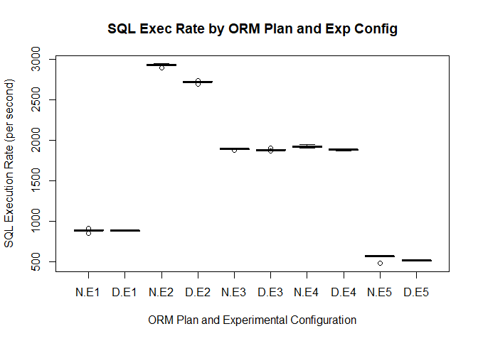
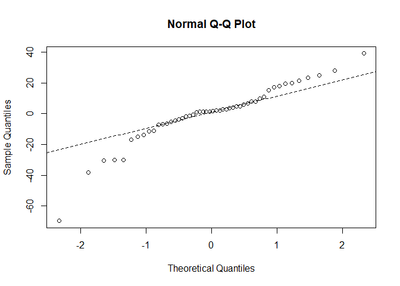
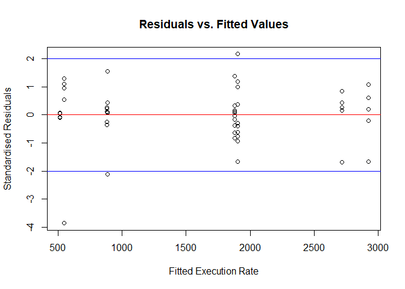

## Summary

I have analysed the model with the experimental configuration restricted
to VMs running in a fixed pool of six (6) physical cores. Strangely
enough, the models improved with only three (3) outliers identified.

These outliers are due to the `INTERNAL_PLAN`. This makes some sense as
this plan exhibits the greatest variance in experimental results.

I do not understand why having a small CPU pool would impact results so
much.

## Overview

This analysis follows on from
"[Analysis of XEN and VirtualBox Tests](https://github.com/dfhawthorne/demos/wiki/Analysis-of-XEN-and-VirtualBox-Tests)".
I ran an extra round of load tests with the size of the CPU pool set to
six (6).

## Initial Analysis of Data

I have excluded any load test runs that were done on experimental
configurations that had less than six (6) physical cores:


```r
all_data               <- rbind(
  virtualbox_data,
  xen_data,
  extra_xen_data)
all_data$platform      <- factor(all_data$platform)
all_data$dbid          <- factor(all_data$dbid)
all_data$plan          <- factor(all_data$plan)
all_data$X             <- NULL
all_data["server"]     <- "VICTORIA"
all_data[all_data$startup_time == "12-Jan-21 07:17", "server"] <- "COOGEE" 
all_data[all_data$startup_time == "12-Jan-21 10:29", "server"] <- "COOGEE"
all_data$server        <- factor(all_data$server)
all_data["plan_abbr"]  <- factor(
  all_data$plan,
  c("INTERNAL_PLAN", "DEFAULT_PLAN"),
  labels=c("N", "D")
)
only_6_core_pools      <- all_data$startup_time != "15-Jan-21 13:28" &
                          all_data$startup_time != "15-Jan-21 20:33"
core_data              <- all_data[only_6_core_pools, ]
core_data$startup_time <- factor(core_data$startup_time)
core_data["expr_cfg"]  <- factor(
  core_data$startup_time,
  c("12-Jan-21 07:17","12-Jan-21 10:29","16-Jan-21 13:56",
    "18-Jan-21 08:36","18-Jan-21 11:52"),
  labels=c("E1","E2","E3","E4","E5")
)
summary(core_data)
```

```
##             plan       num_cpus      rate            memory     
##  DEFAULT_PLAN :25   Min.   :1   Min.   : 479.9   Min.   :5.410  
##  INTERNAL_PLAN:25   1st Qu.:1   1st Qu.: 877.3   1st Qu.:5.410  
##                     Median :6   Median :1880.1   Median :5.410  
##                     Mean   :4   Mean   :1604.6   Mean   :5.426  
##                     3rd Qu.:6   3rd Qu.:1920.3   3rd Qu.:5.450  
##                     Max.   :6   Max.   :2942.9   Max.   :5.450  
##              platform  logical_reads       user_calls    SQL_executes   
##  Linux x86 64-bit:50   Min.   : 564472   Min.   :1024   Min.   : 512.9  
##                        1st Qu.: 986141   1st Qu.:1764   1st Qu.: 881.5  
##                        Median :2077313   Median :3770   Median :1888.9  
##                        Mean   :1795637   Mean   :3237   Mean   :1622.2  
##                        3rd Qu.:2138589   3rd Qu.:3881   3rd Qu.:1945.8  
##                        Max.   :3360532   Max.   :6012   Max.   :3006.5  
##         dbid             startup_time  snap_time              server  
##  908248820:20   12-Jan-21 07:17:10    Length:50          COOGEE  :20  
##  987761581:30   12-Jan-21 10:29:10    Class :character   VICTORIA:30  
##                 16-Jan-21 13:56:10    Mode  :character                
##                 18-Jan-21 08:36:10                                    
##                 18-Jan-21 11:52:10                                    
##                                                                       
##  plan_abbr expr_cfg
##  N:25      E1:10   
##  D:25      E2:10   
##            E3:10   
##            E4:10   
##            E5:10   
## 
```

## Graphical Exploration of Data

Since I need to have the VM shut down before reconfiguring the VM, I can
use the database start-up time to identify the experimental
configuration. I use the same response variable (`rate`) as I used in
the preliminary analysis.


```r
boxplot(
    rate~plan_abbr*expr_cfg,
    data=core_data,
    main="SQL Exec Rate by ORM Plan and Exp Config",
    xlab="ORM Plan and Experimental Configuration",
    ylab="SQL Execution Rate (per second)"
    )
```



The experimental configurations were done as follows:

| Time            | Abbr | VM Host    | Physical Cores |
| --------------- | ---- | ---------- | -------------- |
| 12-Jan-21 07:17 | E1   | `COOGEE`   |              1 |
| 12-Jan-21 10:29 | E2   | `COOGEE`   |              6 |
| 16-Jan-21 13:56 | E3   | `VICTORIA` |              6 |
| 18-Jan-21 08:36 | E4   | `VICTORIA` |              6 |
| 18-Jan-21 11:52 | E5   | `VICTORIA` |              1 |


### Linear Model

Let's consider a three (3) factor model with all possible interactions
between them:

1. `num_cpus`
2. `server`
3. `plan`


```r
core_data.lm = lm(rate~num_cpus*server*plan,data=core_data)
anova(core_data.lm)
```

```
## Analysis of Variance Table
## 
## Response: rate
##                      Df   Sum Sq  Mean Sq   F value    Pr(>F)    
## num_cpus              1 26823688 26823688 68964.447 < 2.2e-16 ***
## server                1  5411773  5411773 13913.819 < 2.2e-16 ***
## plan                  1    43537    43537   111.936 2.030e-13 ***
## num_cpus:server       1   945925   945925  2432.001 < 2.2e-16 ***
## num_cpus:plan         1    11535    11535    29.657 2.477e-06 ***
## server:plan           1    24242    24242    62.326 7.855e-10 ***
## num_cpus:server:plan  1    31715    31715    81.540 2.154e-11 ***
## Residuals            42    16336      389                        
## ---
## Signif. codes:  0 '***' 0.001 '**' 0.01 '*' 0.05 '.' 0.1 ' ' 1
```

All interactions are significant.


### Analysis of Residuals

The NULL hypothesis that the residuals in the linear model are normally
distributed is rejected at the 5% level.


```r
shapiro.test(core_data.lm$residuals)
```

```
## 
## 	Shapiro-Wilk normality test
## 
## data:  core_data.lm$residuals
## W = 0.91568, p-value = 0.001651
```

This is confirmed visually with the Q-Q Plot:


```r
par(mfrow=c(1,1))
qqnorm(core_data.lm$residuals)
qqline(core_data.lm$residuals,lty=2)
```



There is a very large deviation from the expected normal distribution of
residuals at one end of the distribution that could be caused by one (1)
or two (2) outliers. Let's see where these deviations are where in the
experimental data by plotting the residuals against the fitted values
for the response variable (`rate`):


```r
core_data["std_residual"] = core_data.lm$residuals/sqrt(mean(core_data.lm$residuals^2))
plot(core_data.lm$fitted.values,
     core_data$std_residual,
     main="Residuals vs. Fitted Values",
     xlab="Fitted Execution Rate",
     ylab="Standardised Residuals")
abline(h=0, col="red")
abline(h=2, col="blue")
abline(h=-2, col="blue")
```



### Identify Outliers

From the above graph, the outliers are identified by standardised
residuals being more than two (2) or less than -2. 


```r
core_data[abs(core_data$std_residual) > 2, c("startup_time", "server", "num_cpus", "plan") ]
```

```
##       startup_time   server num_cpus          plan
## 10 12-Jan-21 07:17   COOGEE        1 INTERNAL_PLAN
## 56 18-Jan-21 08:36 VICTORIA        6 INTERNAL_PLAN
## 58 18-Jan-21 11:52 VICTORIA        1 INTERNAL_PLAN
```

## Model Results


```r
summary(core_data.lm)
```

```
## 
## Call:
## lm(formula = rate ~ num_cpus * server * plan, data = core_data)
## 
## Residuals:
##     Min      1Q  Median      3Q     Max 
## -69.712  -6.232   1.345   7.918  38.990 
## 
## Coefficients:
##                                           Estimate Std. Error t value Pr(>|t|)
## (Intercept)                                512.402     10.730  47.755  < 2e-16
## num_cpus                                   367.719      2.495 147.404  < 2e-16
## serverVICTORIA                            -272.897     15.123 -18.045  < 2e-16
## planINTERNAL_PLAN                          -32.332     15.174  -2.131  0.03901
## num_cpus:serverVICTORIA                    -94.006      3.300 -28.486  < 2e-16
## num_cpus:planINTERNAL_PLAN                  39.522      3.528  11.203 3.40e-14
## serverVICTORIA:planINTERNAL_PLAN            71.385     21.387   3.338  0.00178
## num_cpus:serverVICTORIA:planINTERNAL_PLAN  -42.143      4.667  -9.030 2.15e-11
##                                              
## (Intercept)                               ***
## num_cpus                                  ***
## serverVICTORIA                            ***
## planINTERNAL_PLAN                         *  
## num_cpus:serverVICTORIA                   ***
## num_cpus:planINTERNAL_PLAN                ***
## serverVICTORIA:planINTERNAL_PLAN          ** 
## num_cpus:serverVICTORIA:planINTERNAL_PLAN ***
## ---
## Signif. codes:  0 '***' 0.001 '**' 0.01 '*' 0.05 '.' 0.1 ' ' 1
## 
## Residual standard error: 19.72 on 42 degrees of freedom
## Multiple R-squared:  0.9995,	Adjusted R-squared:  0.9994 
## F-statistic: 1.223e+04 on 7 and 42 DF,  p-value: < 2.2e-16
```
