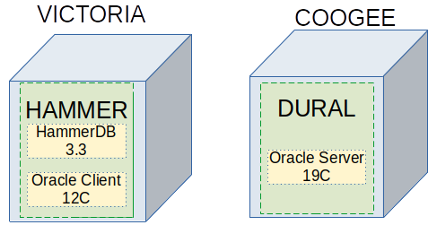

Design Journal Entry 2020-11-13
===============================

Overview
--------

The workload will be simulated using HammerDB 3.3 using an Oracle 12C client against a single PDB running Oracle RDBMS 19C. The workload driverand database server are on separate physical hosts.

Design Options for System Layout
================================

My design options for the system layout were:
1. Monolithic test driver and database server on same physical host.
2. Monolithic test driver and database server on same VM.
3. Separate VM images for test driver and database server on same physical host.
4. Separate VM images for test driver and database server on different physical hosts.

Option 4 was chosen because of operating system availability and to avoid competition for CPU resources.

Option 1: Monolithic test driver and database server on same physical host
--------------------------------------------------------------------------

In this design option, the test driver and database server would have been deployed on the same physical host. This would have been the simplest option.

This would have restricted me to my Windows 10 laptop which does not sufficient disk space for this. My 64-bit Linux servers are either Ubuntu or Xen - neither of these support an Oracle database server. Oracle RDBMS software is no longer shipped for 32-bit operating systems.

Option 2: Monolithic test driver and database server on same VM
---------------------------------------------------------------

In this design option, the test driver and database server would have been deployed on the same VM. This would have been the next simplest option, and was the original design for the __HAMMER__ VM.

This would have allowed me to choose the appropriate operating system for the experiment.

I rejected this option because I was concerned about possible CPU conflicts between the test driver and the database server under 100% load. I was not confident that the VM software could handle this well.

Option 3: Separate VM images for test driver and database server on same physical host
--------------------------------------------------------------------------------------

In this design option, the test driver would be on one VM (__HAMMER__) and the database server would be on another VM (__DURAL__). Both VM images would be on the same physical host (__COOGEE__).

This design would have removed any possible network bottleneck on load generation. The network performance nows becomes a consideration because of the separation into two (2) VM images.

I rejected this option because I would have restricted the maximum number of CPUs I could allocate to the database server VM (__DURAL__).

Option 4: Separate VM images for test driver and database server on different physical hosts
--------------------------------------------------------------------------------------------

In this design option, the test driver would be on one VM (__HAMMER__) and the database server would be on another VM (__DURAL__). These VM images would be on different physical hosts (__VICTORIA__ and __COOGEE__).

Since this was a CPU load, I did not expect the Network to be a bottleneck.

I chose this option because I had the option of using all of the CPUs on __COOGEE__ if I needed to.

Design Options for Test Software
================================

My design options for choice of test software were:
1. Home-grown suite
2. [HammerDB](https://hammerdb.com/)

I chose HammerDB because it would me with experience in using this software, and the results would provide meaningful transaction metrics.

Option 1: Home-grown Suite
--------------------------

The option of using a home-grown suite of test scripts has the advantage of simplicity and familarity. I have used such a suite in my previous demonstration of CDB resource plans.

Option 2: HammerDB
------------------

[HammerDB](https://hammerdb.com/) promotes itself as "...the leading benchmarking and load testing software for the worlds most popular databases supporting Oracle Database..." and is "...Free and open-source software...".

The disadvantages of this option is that I have learn this tool.

The advantage is that I gain experience with this tool, and the transaction results have some meaning within the performance community.

I chose this option.

Final Design
============

The final design is shown as:

There are two (2) physical hosts:
1. __VICTORIA__ which is my XEN virtualisation server.
2. __COOGEE__ which is my Ubuntu workstation.

I have deployed a single VM on each:
1. __HAMMER__ will drive the workload.
2. __DURAL__ will host the database being stress-tested.

Both of these VM images are based on Oracle Linux 8.
