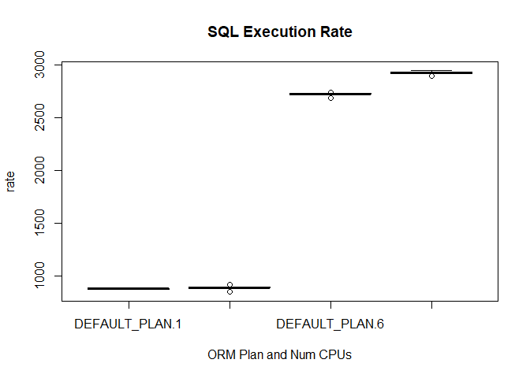
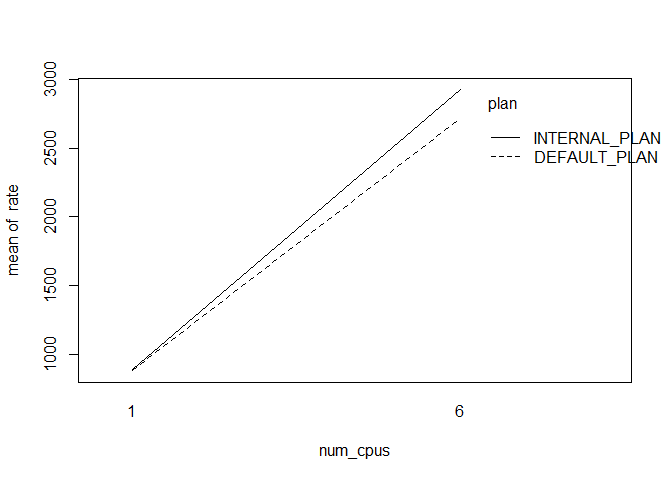
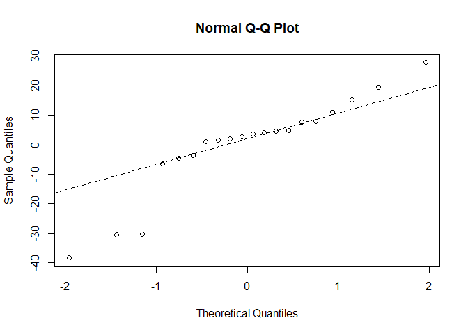
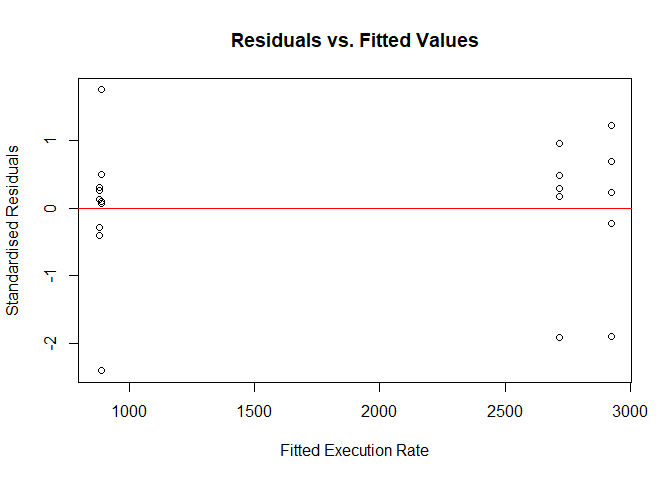

## Overview

This is a preliminary analysis of a $2^k$ experiment done on a Compaq
Presario of the effects of different Oracle Resource Manager (ORM) plans
and differing number of cores on the rate of execution a CPU-intensive
SQL statement.

Craig Shallahammer did a Webinar in November 2020 in which he explored
ORM and commented that there was no noticeable effect in using an ORM
plan on throughput. I had done an investigation using ORM plans for CDB
and found a 13% improvement in throughput. (See
"[High CPU Usage with a CDB Resource Plan](https://yaocm.wordpress.com/2019/12/17/high-cpu-usage-with-a-cdb-resource-plan/)".)

In this experiment, I found that there appeared to be no difference in
throughput when on a single CPU on whether an ORM plan was used or not.
However on six (6) CPUs, the use of an ORM plan decreased the
throughput.

The quality of the data collected as 25% of the observations are
classified as outliers, and the errors predicted (residuals) by the
statistical model are not normally distributed.

Given the contradictory results collected so far, and the data quality
issue, I will have to do further analysis.

## Experimental Setup

The source code used in this experiment can be found in my
[DEMOS](https://github.com/dfhawthorne/demos) GIT repository
under the `resource_manager_thruput` directory.

The following ansible playbooks were used to build and configure the
HammerDB and Oracle 19C databases on existing Oracle Linux 8 VMs:

1. `create_test_server/yml`
2. `install_hammerdb.yml`
3. `configure_sut/yml`

The database server VM was configured with either one (1) or six (6)
CPUs and the experiment was run using the following playbook:

- `run_hammerdb_test.yml`

This playbook ran a 15 minute load test with AWR snapshots before and
after. The ORM plan was randomly selected.

The AWR reports were collected in the `awr_reports` directory (not part
of the GIT repository). The follwoing Pyhton3 script was run to extract
the relevant statistics from the collected AWR and save them into a CSV
file, `results.csv`.

- `extract_stats_from_awr_rpt.py`

## Oracle Resource Manager (ORM) Plans

The Oracle Resource Manager (ORM) plans used are both supplied by
Oracle:

- __INTERNAL\_PLAN__ means that __NO__ ORM plan is active.
- __DEFAULT\_PLAN__ provides minimal resource manager.

## Data from Test Run

The data from the test runs were extracted from AWR reports collected on
Tuesday 12 January 2021.


```r
raw_data$plan     <- factor(raw_data$plan)
raw_data$X        <- NULL
summary(raw_data)
```

```
##             plan       num_cpus        rate       
##  DEFAULT_PLAN :10   Min.   :1.0   Min.   : 848.9  
##  INTERNAL_PLAN:10   1st Qu.:1.0   1st Qu.: 884.7  
##                     Median :3.5   Median :1801.7  
##                     Mean   :3.5   Mean   :1852.4  
##                     3rd Qu.:6.0   3rd Qu.:2773.9  
##                     Max.   :6.0   Max.   :2942.9
```

__Note__ There are two (2) factors with a replication of five (5) for
each interaction term. In other words, this is a $2^2$ factorial
experiment on:

1. ORM Plan Name (Qualitative)
1. Number of CPUs (Quantitative)

The response variable is called `rate` which is calculated as the number
of executions of the following SQL statement over the elapsed time
between AWR snapshots:

```sql
SELECT count(*) AS num_items FROM ITEM
```

## Graphical Examination of Raw Data


```r
boxplot(rate~plan*num_cpus, data=raw_data,  
  col=(c("gold","darkgreen")),
  main="SQL Execution Rate", xlab="ORM Plan and Num CPUs")
```



On one (1) CPU, there is no discernible difference in SQL execution rate
between the ORM plans. However, there is a difference when running on
six (6) CPUs.

There are also five (5) outliers identified by circles. This is a very high proportion (25%) of the number of observations (20).

The variance within each combination of plan and number of CPUs is very low relative to their respective means.

The execution rate appears to be significantly less than a linear growth
in the number of CPUs. With six (6) CPUs, the expected linear
extrapolation in the execution rate should be about 5,000/sec. Instead,
the maximum rate is under 3,000/sec. This would indicate a 40% penalty
in managing multiple CPUs under very high load.

## Fit ANCOVA model

Because we have a qualitative factor (_ORM Plan_) and a quantitative
factor (_Number of CPUs_), and the response variable (_rate_) is continuous, we can analyse the experimental data using ANCOVA:


```r
rate.lm <- lm(rate ~ plan * num_cpus, data=raw_data)
anova(rate.lm)
```

```
## Analysis of Variance Table
## 
## Response: rate
##               Df   Sum Sq  Mean Sq  F value    Pr(>F)    
## plan           1    56176    56176   175.69 4.809e-10 ***
## num_cpus       1 18767627 18767627 58694.63 < 2.2e-16 ***
## plan:num_cpus  1    48813    48813   152.66 1.346e-09 ***
## Residuals     16     5116      320                       
## ---
## Signif. codes:  0 '***' 0.001 '**' 0.01 '*' 0.05 '.' 0.1 ' ' 1
```

Thus we reject the NULL hypotheses that:

1. The ORM plan used does not affect the execution rate;
2. The number of CPUs does not affect the execution rate; and
3. The interaction between two (2) factors does affect the execution.


## Interaction

The interaction can be best visualised as follows:


```r
attach(raw_data)
interaction.plot(num_cpus,plan,rate)
```



As can be readily seen, the execution rate barely differs between the
choice of ORM plans when executing on one (1) CPU. However having six
(6) CPUs available, the `INTERNAL_PLAN` performs better.

## Checking Residuals

For the about statistical tests to be valid, the residuals should be
normally distributed. The primary statistical test for normalcy is the Shapiro-Wilkes test:


```r
shapiro.test(rate.lm$residuals)
```

```
## 
## 	Shapiro-Wilk normality test
## 
## data:  rate.lm$residuals
## W = 0.87802, p-value = 0.0163
```

The NULL hypothesis that the residuals are normally distributed is
rejected at the 5% level. This is borne out by the Q-Q Plot:


```r
par(mfrow=c(1,1))
qqnorm(rate.lm$residuals)
qqline(rate.lm$residuals,lty=2)
```



As can be seen above, there are serious departures from the normal
distribution for the residuals from the linear model. There appear to be
five (5) outliers. This correlates with the observations made in the
original box-plot made above.

These residuals can be plotted against the fitted values as follows:


```r
plot(rate.lm$fitted.values,
     rate.lm$residuals/sqrt(mean(rate.lm$residuals^2)),
     main="Residuals vs. Fitted Values",
     xlab="Fitted Execution Rate",
     ylab="Standardised Residuals")
abline(h=0, col="red")
```




The outliers really stand out in the above plot.
